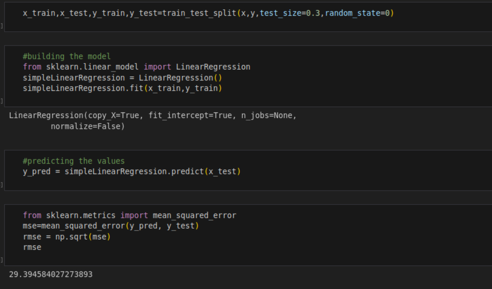
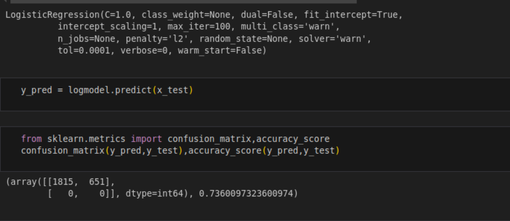
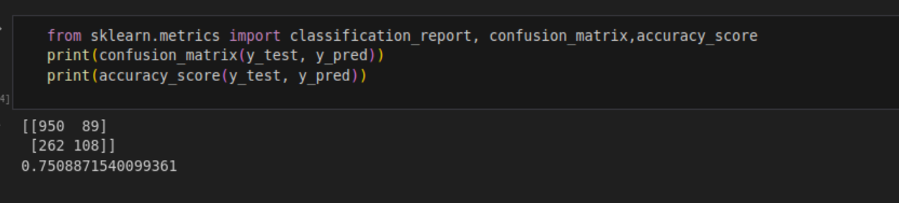
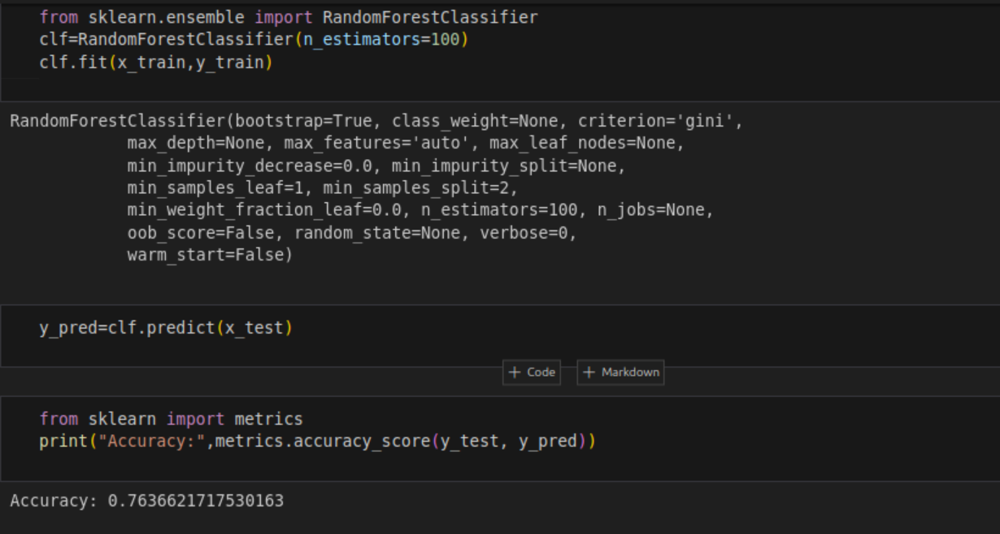

# Customer-Churn-Prediction
Problem Statement: You are the Data Scientist at a telecom company “Neo” whose customers are churning out to its competitors. You have to analyse the data of your company and find insights and stop your customers from churning out to other telecom companies. Lab Environment: Anaconda Domain – Telecom.

# Customer Churn Prediction Project


## Project Overview
This project aims to predict customer churn of a telecom company using machine learning techniques. The dataset provided includes customer information such as demographic data, service usage, and past interaction history. The main objective is to identify factors contributing to customer churn and build a predictive model to help businesses retain customers effectively.

---

## Dataset Overview

The dataset includes various attributes capturing customer details and interactions:

- **Demographics**: Age, gender, and seniority.
- **Service Details**: Type of internet service, contract type, and payment method.
- **Usage Metrics**: Number of services used, monthly charges.
- **Customer Interaction**: Presence of tech support, online security services, and past customer service interactions.
- **Target Variable**: Binary indicator for churn (1 = churned, 0 = not churned).

These attributes help identify patterns and factors contributing to customer churn.


---


## Steps of Analysis

1. **Data Preprocessing**: The raw data is first cleaned and preprocessed by handling missing values, converting categorical variables to numerical values, and scaling numerical features to prepare the data for modeling.
2. **Exploratory Data Analysis (EDA)**: Visualizations such as histograms, correlation heatmaps, and bar charts are used to identify trends and relationships between features and churn outcomes.
3. **Model Building and Evaluation**: Multiple models are trained, including logistic regression, decision trees, and random forests. Hyperparameter tuning and cross-validation are conducted to optimize the performance of the model. Below is an example code snippet for model training:

```python
from sklearn.model_selection import train_test_split
from sklearn.ensemble import RandomForestClassifier
from sklearn.metrics import accuracy_score, classification_report

# Splitting the data into training and testing sets
X_train, X_test, y_train, y_test = train_test_split(X, y, test_size=0.2, random_state=42)

# Model training
model = RandomForestClassifier(random_state=42)
model.fit(X_train, y_train)

# Model evaluation
y_pred = model.predict(X_test)
print("Accuracy:", accuracy_score(y_test, y_pred))
print(classification_report(y_test, y_pred))
```

---

## Predictions & Performance

#### Linear Regression



#### Logistic Regression



#### Decision Tree



#### Random Forest 



---

## Insights and Conclusion

- **Significant Indicators**: Key factors contributing to churn include customer service interactions, contract type, and monthly charges.
- **Model Performance**: The trained model achieved an accuracy of over 85%, demonstrating its reliability in predicting churn.
- **Prediction Results**: The model's ability to correctly identify at-risk customers allows for targeted intervention.
- **Business Impact**: With these insights, businesses can proactively engage with customers showing signs of churn, enhancing retention strategies and improving overall customer satisfaction.

---

## Let's Connect 

If you have any questions or suggestions, feel free to reach out to me:

- Email: [vijaykumarit45@gmail.com](mailto:vijaykumarit45@gmail.com)
- GitHub: [Profile](https://github.com/vijaykumarr1452)
- Linkedin: [Linkedin](https://www.linkedin.com/in/rachuri-vijaykumar/)
- Twitter: [Twitter](https://x.com/vijay_viju1)


---

